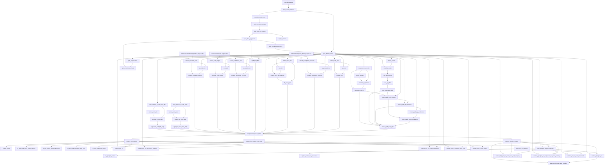

```mermaid
flowchart TD
	node1["aggregate_era5_blh_daily"]
	node2["aggregate_era5_land_daily"]
	node3["aggregate_merra2"]
	node4["analyze_ndvi_fill_distances"]
	node5["aod_aggregate_daily"]
	node6["aod_decode_qa"]
	node7["aod_filter_scale"]
	node8["aod_qa_filter"]
	node9["build_master_feature_table"]
	node10["compute_industrial_fraction"]
	node11["compute_road_density"]
	node12["compute_worldcover_fractions"]
	node13["cpcb_completeness_check"]
	node14["cpcb_correlation_check"]
	node15["cpcb_download_pm25"]
	node16["cpcb_filter_aggregate"]
	node17["cpcb_final_filter"]
	node18["cpcb_finalize_roster"]
	node19["cpcb_find_clusters"]
	node20["cpcb_list_stations"]
	node21["cpcb_merge_downloads"]
	node22["cpcb_qc_check"]
	node23["cpcb_screen_stations"]
	node24["cpcb_trim_and_season"]
	node25["data\raw\osm\industrial_landuse.geojson.dvc"]
	node26["data\raw\osm\power_plants.geojson.dvc"]
	node27["data\raw\osm\roads.geojson.dvc"]
	node28["diagnose_lightgbm_aod_coupling"]
	node29["extract_era5_blh"]
	node30["extract_era5_land"]
	node31["extract_industrial_area"]
	node32["extract_merra2"]
	node33["extract_ndvi_raw"]
	node34["extract_powerplant_distances"]
	node35["extract_road_lengths"]
	node36["extract_srtm_raw"]
	node37["extract_worldcover_raw"]
	node38["fill_ndvi_gaps"]
	node39["finalize_powerplant_distance"]
	node40["finalize_srtm"]
	node41["fit_lightgbm_model"]
	node42["fit_lme_model"]
	node43["fit_lme_model_aod_winsorized"]
	node44["fit_lme_model_excl_outlier_stations"]
	node45["fit_lme_model_gapfill_robustness"]
	node46["fit_lme_model_random_slope_aod"]
	node47["fit_lme_model_raw_target"]
	node48["maiac_extract"]
	node49["maiac_gapfill_apply_fill"]
	node50["maiac_gapfill_build_dataset"]
	node51["maiac_gapfill_fit_calibration"]
	node52["maiac_gapfill_qc_calibration"]
	node53["maiac_gapfill_score_confidence"]
	node54["map_stations_to_cells"]
	node55["map_stations_to_cells_era5"]
	node56["map_stations_to_cells_era5_blh"]
	node57["prepare_lightgbm_dataset"]
	node58["prepare_lme_dataset"]
	node59["prepare_lme_dataset_raw_target"]
	node60["qc_industrial"]
	node61["qc_ndvi"]
	node62["qc_powerplants"]
	node63["qc_roads"]
	node64["qc_srtm"]
	node65["qc_worldcover"]
	node66["tune_lightgbm_hyperparameters"]
	node67["validate_lightgbm_cv"]
	node68["validate_lightgbm_cv_excl_weak_aod_coupling"]
	node69["validate_lightgbm_cv_excl_weak_aod_from_training"]
	node70["validate_lme_cv"]
	node71["validate_lme_cv_aod_winsorized"]
	node72["validate_lme_cv_excl_outlier_stations"]
	node73["validate_lme_cv_gapfill_robustness"]
	node74["validate_lme_cv_random_slope_aod"]
	node75["validate_lme_cv_raw_target"]
	node76["window_qc_era5_blh"]
	node77["window_qc_era5_land"]
	node78["window_qc_merra2"]
	node79["winsorize_aod_dataset"]
	node1-->node9
	node2-->node9
	node3-->node49
	node3-->node50
	node4-->node38
	node5-->node49
	node5-->node50
	node6-->node8
	node7-->node6
	node8-->node5
	node9-->node57
	node9-->node58
	node9-->node59
	node10-->node9
	node11-->node9
	node12-->node9
	node13-->node18
	node15-->node21
	node16-->node13
	node16-->node14
	node16-->node17
	node17-->node9
	node18-->node7
	node18-->node9
	node18-->node17
	node18-->node19
	node18-->node31
	node18-->node33
	node18-->node34
	node18-->node35
	node18-->node36
	node18-->node37
	node18-->node48
	node18-->node49
	node18-->node50
	node18-->node51
	node18-->node52
	node18-->node54
	node18-->node55
	node18-->node56
	node18-->node60
	node18-->node61
	node18-->node62
	node18-->node63
	node18-->node64
	node18-->node65
	node18-->node66
	node18-->node67
	node18-->node68
	node18-->node69
	node18-->node70
	node18-->node71
	node18-->node72
	node18-->node73
	node18-->node74
	node18-->node75
	node19-->node14
	node20-->node23
	node21-->node24
	node23-->node15
	node23-->node18
	node24-->node16
	node24-->node22
	node25-->node31
	node26-->node34
	node27-->node35
	node29-->node76
	node30-->node77
	node31-->node10
	node31-->node60
	node32-->node78
	node33-->node4
	node33-->node38
	node33-->node61
	node34-->node39
	node34-->node62
	node35-->node11
	node35-->node63
	node36-->node40
	node36-->node64
	node37-->node12
	node37-->node65
	node38-->node9
	node39-->node9
	node40-->node9
	node48-->node7
	node49-->node9
	node50-->node51
	node50-->node53
	node51-->node49
	node51-->node52
	node52-->node53
	node53-->node49
	node54-->node3
	node54-->node32
	node54-->node78
	node55-->node30
	node55-->node77
	node56-->node29
	node56-->node76
	node57-->node28
	node57-->node41
	node57-->node66
	node57-->node67
	node57-->node68
	node57-->node69
	node58-->node42
	node58-->node44
	node58-->node45
	node58-->node46
	node58-->node70
	node58-->node72
	node58-->node73
	node58-->node74
	node58-->node79
	node59-->node47
	node59-->node75
	node60-->node10
	node61-->node4
	node62-->node39
	node63-->node11
	node64-->node40
	node65-->node12
	node66-->node41
	node66-->node67
	node66-->node68
	node66-->node69
	node67-->node28
	node76-->node1
	node77-->node2
	node78-->node3
	node79-->node43
	node79-->node71
```
